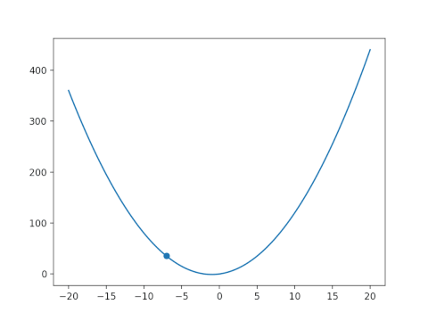

 

Welcome to Langevin Dynamics
===




This is a 1 dimentional langevin dynamics simulator. It has 3 commands:
* __langevin__ -- for running simulation in the command line 
* __langevingui__ -- for a Graphical User Interface for running simulation
* __langevinshow__ -- to visualy see an output of this program (like the one in the left)

It uses velocity verlet as the integrator. 
<br/>

## Requirements

The main requirement is that you must have python 3 installed. Other requirements are installed along this program.

## Installation

Download the zip, and cd to the directory where setup.py is located. 
On a very lucky day the following should work
```sh
$ pip3 install . 
```
In case it does not work try this:

```sh
$ pip3.6 install . --user 
```
## What do you need ?

A text file
containing 4 columns. 
Each line have 4 columns; Index, position and the corresponding
velocity and force. 

This program will show an error if the particle moves beyond potential surface
given in your input file. For the forces corresponding to positions 
that are not exclusively written in the input file will be interpolated.


An example input file :

>1&nbsp;&nbsp;&nbsp;&nbsp;0.0&nbsp;&nbsp;&nbsp;&nbsp;1&nbsp;&nbsp;&nbsp;&nbsp;-1<br /> 
>2&nbsp;&nbsp;&nbsp;&nbsp;0.2&nbsp;&nbsp;&nbsp;&nbsp;2&nbsp;&nbsp;&nbsp;&nbsp;0<br />
>3&nbsp;&nbsp;&nbsp;&nbsp;0.4&nbsp;&nbsp;&nbsp;&nbsp;2&nbsp;&nbsp;&nbsp;&nbsp;0<br />
>4&nbsp;&nbsp;&nbsp;&nbsp;0.6&nbsp;&nbsp;&nbsp;&nbsp;1&nbsp;&nbsp;&nbsp;&nbsp;1<br /> 

So in the given example the particle at position = 0.1 will feel a force of -0.5 and if it evolves 
to position 0.7 or to -0.1 the program will exit will an error.

## Running Langevin

### Command Line Interface
The simplest way to run this program is to type 'langevin' in yout terminal and you will be asked to give some inputs.
```sh
$ langevin
```

Alternatively, the following command-line argument can be given :

| option | description           |
|--------|-----------------------|
|   --x  |  initial position     |
|   --v  |  initial velocity     |
|  --temp|  Temperature          |
| --lamda|  damping coefficient  |
|  --m   |  mass                 |
|  --dt  |  timestep             |
|--steps |  number of step; runtime = dt x steps | 
|  --o   |  Name of the output file (optional; default = 'out.dat') |
|  --i   |  Name of the input file  |
| --help |   in case you are lost  |   


Thus a simple langevin simulation can be run by running the following command for 10 units of time.

```sh
$ langevin --x 1 --v 1 --temp 0.2 --lamda 0.1 --m 1 --dt 0.01 --steps 1000 --i "input.txt" --o "traj.txt"
```

This will create a output file named "traj.txt"

